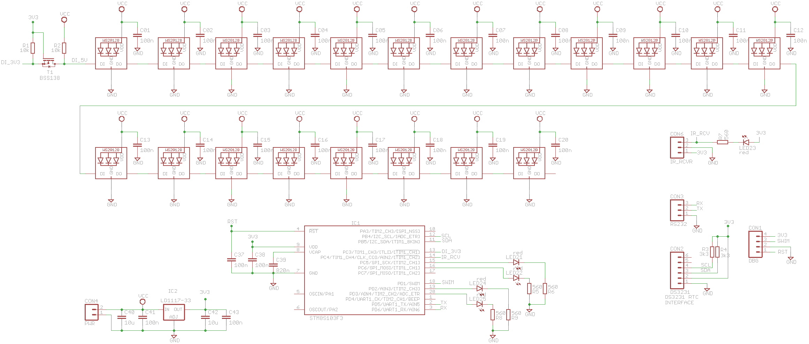

# Binary Clock Project
- 20 x WS2812B leds hrs (2+4), min (3+4), sec (3+4)
- STM8S103F3 uC
- 2 x 2 LEDs for colons
- IR (TL1838) receiver with led indication
- DS3231 RTC
- SWIM debug interface

# Schematic
 
*Schematic of Binary Clock v02*

# Development Environment
IAR development environment for STM8 

# Communication Settings
Settings: 115200, n, 8, 1.
Commands:
b1: real binary, b0: clock binary
d0: Set Date, e.g. 'd0 28-5-2021'
d1: Set Time, e.g. 'd1 11:17:28'
d2: Display Date & Time
d4: Set Blanking start-time, e.g. 'd4 23:30'
d5: Set Blanking end-time, e.g. 'd4 8:30'
ix: Set LED-intensity, x = [1,255]
s0: Display version info
s1: List all scheduler tasks & timing
s2: I2C-scan
w1: WS2812 test-pattern, w0: normal mode

